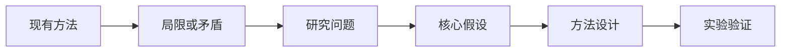

论文分析不应只是摘要的中文转述。更有价值的目标是建立一条可以检查的推理链：**问题从哪里来，方法为什么可能有效，实验是否真的支持结论，以及还有什么没有解决。**

> 这是一篇演示文章，也可以直接复制成今后的论文阅读模板。
{: .prompt-tip }

## 论文信息

| 项目 | 内容 |
| --- | --- |
| 标题 | Paper Title |
| 作者与机构 | Author, Institution |
| 会议或期刊 | Venue, Year |
| 原文 | PDF / arXiv 链接 |
| 代码 | GitHub 链接 |

## 一句话结论

先强迫自己用一句话说明论文的贡献：

> 为了解决 **问题 X**，作者提出 **方法 Y**，并在 **条件 Z** 下证明它优于已有方案。

如果一句话说不清楚，通常意味着我们还没有找到论文真正的主线。

## 研究问题

阅读引言时，可以依次寻找：

1. 现有方法做不到什么？
2. 这个缺口为什么重要？
3. 作者做出了哪些关键假设？
4. 论文声称的贡献是否能被实验验证？



## 核心方法

先忽略实现细节，把方法压缩成三个部分：输入、变换和输出。例如，一个常见的注意力计算可以写成：

$$
\operatorname{Attention}(Q,K,V)
= \operatorname{softmax}\left(\frac{QK^\top}{\sqrt{d_k}}\right)V.
$$

理解公式时不要只记符号，而要逐项回答：

- 每个变量代表什么？
- 哪一步引入了论文的核心创新？
- 复杂度和基线相比发生了什么变化？
- 哪些假设在真实场景中可能不成立？

## 实验是否支持结论

重点检查以下证据：

- **基线是否公平**：训练预算、数据规模和调参力度是否一致？
- **消融是否充分**：性能提升究竟来自核心设计，还是附加技巧？
- **指标是否合适**：指标改善是否代表真实任务价值？
- **结果是否稳定**：是否报告方差、置信区间或多次实验？
- **泛化是否成立**：结论能否跨数据集、模型规模或任务复现？

```python
def claim_supported(result, baseline, uncertainty):
    improvement = result - baseline
    return improvement > uncertainty
```

## 局限与疑问

把作者主动承认的局限和自己发现的局限分开记录。尤其关注：

1. 方法失效的边界条件；
2. 没有被实验覆盖的场景；
3. 额外的算力、数据或工程成本；
4. 论文结论中从相关性跳到因果性的部分。

## 与其他工作的联系

最后不要孤立地结束一篇论文。至少记录一篇前置工作、一篇同期方法和一篇后续工作，逐渐形成自己的研究地图。

> 最好的论文笔记不是“读完了什么”，而是“接下来知道该问什么”。
{: .prompt-info }
