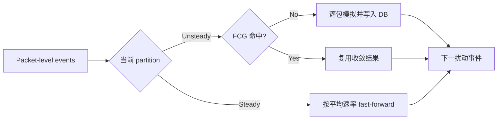

包级网络仿真最昂贵的地方，恰好也是它最值得保留的地方：每一个包、队列变化和拥塞控制反馈都被建模。Wormhole 的思路不是把 ns-3 换成粗粒度估算器，而是问一个更锋利的问题：**如果某段逐包过程已经算过，或者系统已经进入几乎不再变化的稳态，为什么还要把相同的离散事件再执行一遍？**

这篇文章完整拆解 NSDI '26 论文 *Supercharging Packet-level Network Simulation of Large Model Training via Memoization and Fast-Forwarding*。除了论文方法，我还检查了作者留下的匿名 artifact、它与最终论文的实现差距，以及几个容易被标题数字掩盖的实验口径问题。

> 先给结论：Wormhole 抓住了大模型训练流量中非常真实的两类冗余，设计也比“直接跳时间”细致得多；但目前能访问的代码只是早期原型，**不足以独立复现最终论文的 744× / 1012× 结论**。
{: .prompt-warning }

## Paper card

| 项目 | 内容 |
| --- | --- |
| 论文 | *Supercharging Packet-level Network Simulation of Large Model Training via Memoization and Fast-Forwarding* |
| 作者 | Fei Long, Kaihui Gao, Li Chen, Dan Li, Yiwei Zhang, Fei Gui, Yitao Xing, Wenjia Wei, Bingyang Liu |
| 发表 | 23rd USENIX NSDI, 2026, pp. 1131–1151 |
| 正式页面 | [USENIX presentation page](https://www.usenix.org/conference/nsdi26/presentation/long) |
| 正式论文 | [USENIX PDF](https://www.usenix.org/system/files/nsdi26-long.pdf) · [arXiv](https://arxiv.org/abs/2602.10615) |
| 可访问代码 | [匿名预发布 artifact](https://anonymous.4open.science/api/repo/Wormhole/zip)，不是最终版本的完整实现 |
| 阅读范围 | 正文、全部图表、Table 1 与 Appendices A–I |

## 一句话理解 Wormhole

Wormhole 仍然把 PLDES（packet-level discrete-event simulation）当作正确性基座，但把可省略的时间分成两种：

1. **Unsteady state**：拥塞控制正在收敛。如果同构的流冲突模式以前模拟过，直接复用结果；
2. **Steady state**：发送速率已经稳定。用测得的平均速率推进到下一次扰动，不再逐包执行中间事件。

_Figure 1. 黄色是不稳态，绿色是稳态；第一次出现的不稳态被记住，重复出现时命中缓存。来源：Long et al., NSDI '26, Figure 1。_

它减少的是**事件数量**；Unison 一类并行 DES 优化的是**事件如何分给多个 CPU 核**。两者因此可以叠加，而不是互相替代。

## 为什么一次训练仿真会慢到数周

训练一个大模型会持续产生 data parallel、pipeline parallel 和 expert parallel 通信。这里不只是流很多：大量 collective 会形成 GB 级 elephant flows，而包级模拟器要按时间顺序处理发送、入队、出队、ACK、ECN、丢包和拥塞窗口更新。论文估计，大规模场景可以超过 $O(10^{12})$ 个离散事件；ASTRA-sim 接 ns-3 模拟 GPT-175B 的一个 iteration 可达到“数周”量级。

常见的加速路线各有代价：

| 路线 | 做法 | 论文指出的问题 |
| --- | --- | --- |
| Flow-level | 用 max-min fairness 等方式直接分配流带宽 | 快，但难以保留排队、丢包和 CCA 瞬态；实验约 20% 平均 FCT 误差 |
| 学习或解析近似 | 用模型预测网络性能 | 依赖训练分布或简化假设，跨协议与拓扑泛化困难 |
| Parallel DES | 在多个核上执行事件 | 同步和负载不均使加速次线性；论文中的 Unison 峰值不到 10× |
| Wormhole | 避免执行可复用、可跳过的事件 | 需要可靠识别“什么真的可以不算” |

Wormhole 最重要的判断是：LLM 训练网络不是一般的随机互联网流量。固定并行策略会重复相同的 collective，拥塞控制收敛后又会长时间维持相似的速率，因此事件流里存在非常高的结构性冗余。

_Figure 3. 左：重复 contention pattern 的数量；右：steady-state 占比。真实 256-GPU GPT-18B trace 同样表现出高重复与高稳态比例。来源：论文 Figure 3。_

论文报告：

- 128 GPU 的 GPT-13B / MoE-8×7B，每轮有超过 1,200 次重复模式；
- 1024 GPU 的 GPT-175B / MoE-32×22B，接近 40,000 次；
- 真实 GPT-18B trace 中，65,870 个 pattern instances 只对应 1,488 个 distinct patterns；
- dense GPT 的稳态占比超过 99%，MoE 约 97.5%，真实 trace 为 98.82%。

这就是论文的基本赌注：**不是近似整个网络，而是精确找出逐包执行中重复、稳定的部分。**

## 第一步：把网络切成可以独立推进的 partition

直接判断“整个网络是否稳态”几乎没有用：只要某个角落有新流进入，全网都不能快进。Wormhole 因此先做 port-level network partitioning。

定义很直接：如果两条 flow 共享一条 link / port，它们属于同一个连通分量；不共享链路的 flow 集合可以独立处理。实现上构造 flow–link 二部图，再用 DFS 找 connected components。

_Figure 4. 左：共享端口的 flows 被划入同一 partition；右：两个 partition 被压缩成 FCG。来源：论文 Figure 4。_

端口粒度比 switch 粒度更重要：同一台交换机上的两个端口可能没有相同链路依赖，只按交换机切分会把本来独立的流绑在一起，减少稳态识别和并行机会。

论文把静态 partition 算法写成 $O(N+M)$。严格地说，更完整的复杂度应是 $O(V+E)$：除了 flow 和 link 顶点，还要计入“flow 经过 link”产生的全部 incidence edges。对于路径很长的场景，这个差别不只是记号问题。

动态变化时不需要重算全网：

- 新流不触及现有 partition：新建一个；
- 新流触及一个：加入其中；触及多个：局部合并并重算；
- 流结束后：只检查它原来的 partition 是否需要分裂。

一个 partition 只有在**所有 flow 都稳定**时才被认为稳定。这个保守条件牺牲了一些跳过机会，换来更清楚的依赖边界。

## 第二步：用 FCG 记住不稳态

不稳态是 CCA 从初始条件走向收敛的过程，通常难以解析求解。Wormhole 不预测这段轨迹，而是把第一次真实模拟的结果缓存起来。

### FCG 是什么

Flow Conflict Graph（FCG）是一个无向加权图：

- vertex 代表 flow，vertex weight 是当前发送速率；
- 两条 flow 至少共享一条 link，就连一条 edge；
- edge weight 是二者重叠 link 的数量。

这个抽象保留“谁和谁争用多少条链路”，但刻意忽略绝对路径长度和流在拓扑中的空间位置。作者认为由此产生的误差可忽略，但论文没有给出一个覆盖所有拓扑的独立消融；不同 RTT、link capacity、queue state、ECN/PFC 配置或 CCA internal state 可能产生同构 FCG，却走出不同 transient。一个稳妥实现还应把完整的网络配置域纳入 cache namespace，而论文没有列清这部分 key。

缓存的形式可以写成：

$$
\text{key}=FCG_{start}
$$

$$
\text{value}=\left(FCG_{end},\{Size_f\}_{f\in F},T_{conv}\right)
$$

它不保存完整时间序列，只保存收敛前后的 FCG、每条流在不稳态传输的数据量，以及 convergence time。

查询时，先按 vertex / edge 数过滤明显不匹配的候选，再做 weighted graph isomorphism。命中后，按同构映射把缓存结果还原到当前 flow；未命中才逐包模拟，并在结束后写入数据库。

_Figure 6. 黄色区域对不稳态做查询与 memoization，绿色区域识别并跳过稳态；flow enter/exit 等事件会让 partition 重建。来源：论文 Figure 6。_

这里有个容易误读的点：memoization 并不是千倍加速的主因。论文的 breakdown 显示，在已经跳过稳态之后，memoization 再提供约 1.93×–8.43×；最大的收益仍来自稳态 fast-forwarding。

## 第三步：只看发送速率，能否判断稳态

论文先把 flow 的稳态定义为：在区间 $[t_s,t_f]$ 内，发送速率 $R$、拥塞窗口 $cwnd$、RTT、队列长度 $Q$ 和 in-flight bytes $I$ 的最大值与最小值之差都足够小。

实现中若同时监控五个量，开销大且重复。Wormhole 实际只采样发送速率。对长度为 $l$ 的窗口：

$$
\Delta R_l(t)=
\frac{\max_{1\le k\le l}R(t_k)-\min_{1\le k\le l}R(t_k)}
{\frac{1}{l}\sum_{k=1}^{l}R(t_k)}
$$

当 $\Delta R_l(t)<\theta$，flow 被判定为进入稳态，稳态速率用窗口均值估计：

$$
\hat R=\frac{1}{l}\sum_{k=1}^{l}R(t_k)
$$

实验默认 $\theta=5\%$、$l=2000$。

### 论文给出的理论保证

Theorem 1 在“CCA 已收敛”的前提下，分别借助 HPCC、TIMELY 和 DCTCP 的动力学关系说明：若 $R$ 的波动足够小，$cwnd$、RTT、$Q$ 与 $I$ 也存在有限的小波动。

Theorem 2 给出稳态平均速率估计的相对误差上界：

$$
\left|\frac{\hat R-R}{R}\right|<\frac{\theta}{1-\theta}
$$

Theorem 3 给出稳态持续时间估计的相对误差：

$$
\left|\frac{\hat T-T}{T}\right|<\theta
$$

当 $\theta=5\%$ 时，这两个上界分别是 5.26% 和 5%。因此，“平均 FCT 误差小于 1%”是**实验结果**，不是理论保证。理论证明也依赖所分析 CCA 的收敛模型，并不能自动外推到任意自定义控制器。

Appendix F 进一步说明：$\theta$ 应略高于 CCA 本身的周期性波动；$l$ 至少覆盖一个 CCA 周期。窗口太短会把局部片段误当成稳定，太长则进入稳态太晚，损失加速。需要注意，承载这些证明的 Appendices 在论文中明确标记为 supporting material，未经过同行评审。

## 第四步：快进时间，但不破坏共享状态

“检测到稳态后把时钟加一段”听起来简单，真正实现却有两个坑。

### 1. 不能移动全局时钟

不同 partition 可能处在不同阶段。Wormhole 保持 ns-3 的 global clock 正常前进，只把目标 partition 关联事件的 timestamp 整体增加 $\Delta T$，同时更新流的 remaining size 与 sequence number。

### 2. 不能让稳态流从共享 buffer 中消失

两个 partition 虽然不共享 link，仍可能使用同一交换机的 shared buffer。如果快进时直接把稳态流的包清空，其他端口会凭空获得更多缓存，丢包时机也会改变。论文的处理是暂停目标 port 的 packet processing，并冻结其 buffer occupancy，直到退出稳态。这保住了静态占用，但不一定重现动态 shared-buffer threshold、PFC headroom、跨端口调度或周期性 ECN / loss；因此 partition 更接近“可管理的近似边界”，而不是数学上完全无耦合的子网。

_Figure 7. 进入稳态后暂停端口事件并把 partition 的时间戳偏移到最早 interrupt；未知实时事件出现时执行 skip-back。来源：论文 Figure 7。_

能够结束稳态的事件有三类：新流进入、旧流完成、现有流 reroute（例如链路故障或负载均衡）。若时间已知，最早 interrupt timestamp 就是快进终点；若事件实时到来，论文提出 skip-back：partition 的事件虽然已被推到 $T_1$，但只要全局时钟尚未到 $T_1$、这些事件还未执行，就可以退回更早的 $T_2$。

## 评估：标题里的 1000× 是怎样得到的

### 实验设置

| 维度 | 设置 |
| --- | --- |
| 机器 | 2× Intel Xeon，共 56 cores，128 GB RAM |
| 网络 | 64 / 128 / 256 / 1024 GPU，4 个 Rail-Optimized Fat-tree 规模 |
| 模型 | GPT 7B–175B；MoE 8×7B–32×22B |
| 通信 | DP、PP、EP；按现有模拟器惯例忽略 TP / SP flow |
| CCA | HPCC、DCQCN、TIMELY |
| 默认参数 | $\theta=5\%$，$l=2000$ |
| 基线 | ns-3、Unison、flow-level simulator；真实 trace 另比较 ASTRA-sim+ns-3 |

每个 GPU 在模拟中被当作一个 host，micro-batch size 为 1，global batch 为 $DP\times PP$。结果因此不是对所有训练配置的无条件结论，而是对论文所构造的一轮训练 workload 的测量。

### 速度

_Figure 8. 单核 Wormhole 与 16-core Wormhole+Unison 相对 ns-3 的加速。来源：论文 Figure 8。_

- 单核 Wormhole：GPT 为 227×–约 745×，MoE 为 135×–510×；
- 16-core Wormhole+Unison：GPT 峰值 1012×，MoE 峰值 716×；
- Unison 单独峰值不足 10×；
- HPCC、DCQCN、TIMELY 上都维持数百倍，说明收益并非绑定单一 CCA。

摘要和结论把 GPT 峰值写成 744×，正文范围写成 227×–745×；更合理的理解是作图或四舍五入口径差异，不应把最后一位当成可复现精度。

_Figure 9. 左：只跳稳态已提供主要加速，memoization 继续放大；右：两种机制合计跳过超过 99% 的事件。来源：论文 Figure 9。_

只做 steady-state skipping，GPT 已超过 130×、MoE 超过 50×；加入 memoization 后，GPT 跳过超过 99.5% 的 events，MoE 超过 99.2%。这也解释了为什么 dense GPT 通常比 MoE 更受益：EP all-to-all 更动态，稳定与重复程度更低。

### 准确性

_Figure 10. Wormhole 在论文 workload 上的平均 per-flow FCT 相对误差低于 1%，flow-level 约 20%。来源：论文 Figure 10。_

论文按 flow 计算相对 FCT 误差，再取平均。Wormhole 在不同网络规模和三种 CCA 下均低于 1%；只做 steady skipping 的误差更小，说明新增误差主要来自 FCG 复用，而不是稳态均值本身。

此外，论文选取“每个场景的第一条 flow”，计算其所有 packet RTT 相对 ns-3 的 NRMSE，结果低于 0.005。这个指标支持 packet-level fidelity，但覆盖面比“所有 flow 的所有 packet”窄，不能把它解读成全网逐包轨迹都经过同等强度的验证。

_Figure 12. rate / inflight / queue 三类指标表现接近；窗口与阈值共同控制速度—误差权衡。来源：论文 Figure 12。_

这张图还暴露了一处正文笔误：图和判定式都说明 $l$ 越大，等待窗口越长、speedup 越低；$\theta$ 越大，条件越宽松、speedup 和 error 越高。论文正文却写成“$l$ 增大或 $\theta$ 减小会更容易进入稳态”，方向正好相反。

### 真实训练 trace

_Figure 14. 真实 256-GPU GPT-18B trace 上，Wormhole 仍有约百倍加速；端到端训练时间误差约 3%。来源：论文 Figure 14。_

真实实验来自 256 GPU 的 GPT-18B，使用 Nsight Compute 收集 operation-level collective latency：

- Wormhole 相对 ns-3：97.75×；
- Wormhole+Unison：133.35×；
- Wormhole 的端到端训练时间误差：3.02%；
- ASTRA-sim+ns-3 的对应误差：3.01%。

这比理想化 SimAI workload 的峰值低很多，但更有参考价值。真实 trace 包含 recomputation 和硬件性能波动，重复模式更复杂。也要区分两个误差口径：**“<1%”是合成 workload 的平均 per-flow FCT；真实 trace 的端到端训练时间误差是 3.02%。**

## 几个不能被 headline 掩盖的问题

### 1. “9 小时降到 5 分钟”并不是 1000×

论文正文同时写道：128-GPU GPT-13B 从 9 小时缩短到 5 分钟，并“超过 1000×”。但 $9\text{ hours}/5\text{ minutes}=108\times$，不是 1000×；若真是 1012×，9 小时应降至约 32 秒。

Figure 8 的相对加速曲线确实接近 1000×，所以更可能是绝对时间或文字表述中至少有一处错误。没有公开的最终脚本与原始日志时，无法判断哪一个数字正确。博客或二次引用时应把这两组陈述分开，而不是合并成一个结论。

### 2. 理论上界不是实验中的 1%

$\theta=5\%$ 对应的 rate / duration 理论上界约为 5.26% / 5%。低于 1% 是在特定拓扑、模型和 CCA 上测得的平均 FCT，不是逐流 worst-case guarantee。

### 3. 收益高度依赖 workload 结构

固定 collective、长 elephant flows、稳定路径和可预测扰动最适合 Wormhole。多租户、短流密集、随机路由、频繁故障或动态负载均衡会减少 cache hit 与 steady interval。论文认为最坏情况下可退化回原始 ns-3 且不额外损失准确性，但没有用一个强随机、多租户 workload 系统刻画退化曲线。

### 4. 数据库大小也有一处图文冲突

Appendix H 写道，1024-GPU 场景的 simulation database 小于 100 KB；但同页 Figure 15b 的曲线约为 GPT 370 KB、MoE 510 KB。更稳妥的结论是“仍小于约 0.6 MB、适合内存驻留”，而不是照抄 `<100 KB`。

## Code archaeology：论文和公开 artifact 之间隔着什么

截至 2026-08-14，我没有找到最终 NSDI '26 Wormhole 的公开 GitHub 仓库，USENIX 与 arXiv 页面也没有列出正式 artifact。一个重要线索藏在作者上传的 arXiv LaTeX 源码里：被注释掉的脚注指向一个 [anonymous.4open.science 快照](https://anonymous.4open.science/api/repo/Wormhole/zip)。该快照元数据显示最后更新于 2025-01-30，明显早于最终论文。

我下载并逐层检查了这个快照。它基于 Alibaba 的 [High-Precision-Congestion-Control](https://github.com/alibaba-edu/High-Precision-Congestion-Control) ns-3 工程，许可证为 GPL v2，但更准确的称呼是**早期 steady-state-skipping prototype**。

| 最终论文描述 | 匿名 artifact 中观察到的状态 |
| --- | --- |
| FCG、weighted graph isomorphism、memoization DB | 未找到实现 |
| 动态 port-level partition | 有代码，但 flow 加入/退出的主要逻辑被整段注释 |
| 每个 partition 独立进入稳态和快进 | 活跃路径要求所有 active QP 一起稳定，更接近全局快进 |
| 每 partition event timestamp offset | 实现会遍历并偏移全局 event queue，例外保存部分 flow-start events |
| packet pausing / shared-buffer occupancy | 未找到对应实现 |
| 通用 interrupt queue 与 skip-back | 只看到后续 flow-start EventId 的保存，未看到完整机制 |
| Wormhole+Unison 与并发 DB | 未找到 |
| 论文默认 $l=2000,\theta=5\%$ | 代码硬编码 $l=1000,\theta=3\%$ |

早期代码确实能看到核心雏形：每微秒采样 QP 速率、用 $(max-min)/avg$ 判稳、估计下一流到达或最早完成时间、扣减剩余字节，并调用 simulator event offset。它也暴露了一些尚未解释的工程细节，例如快进数据量使用 `average_rate / 1.07` 修正。

复现摩擦同样较高：README 大部分仍是上游 HPCC 文档，构建脚本依赖 gcc-5 / Python 2 且有路径问题，没有 Wormhole 专用测试，随附的部分结果文件为空。我没有在当前环境强行修改旧依赖把它“修到能跑”，因为那样得到的是我们自己的移植版，不再是对作者 artifact 原样可复现性的检验。

> 因此，这个快照可以证明作者早期实现过“稳态检测 + 事件快进”的主干，但不能证明最终论文的 memoization、partition-local correctness 和 744× / 1012× 结果可由公开代码复现。
{: .prompt-danger }

## 我怎样评价这篇论文

### 做得好的地方

1. **问题选得准**：它没有继续堆硬件并行，而是直接消除重复事件，能与多核优化叠加；
2. **抽象层次漂亮**：partition 负责隔离依赖，FCG 负责识别重复 transient，rate window 负责识别 steady interval；
3. **实现意识强**：packet pausing、timestamp offset、interrupt termination 都是在真实 DES 内核里必须处理的问题；
4. **真实 trace 仍有效**：虽然从千倍降到百倍，但没有在现实扰动下完全失效；
5. **误差—加速关系可调**：$l$ 和 $\theta$ 把“更早跳过”与“更保守识别”放在一个可解释旋钮上。

### 仍需补强的地方

1. 最终实现和原始实验没有正式公开，reproducibility 是当前最大缺口；
2. FCG 忽略绝对位置与路径长度的安全边界缺少专门消融；
3. packet RTT 只覆盖每个场景第一条 flow，tail behavior 验证仍偏窄；
4. TP / SP flows 被忽略，不能直接代表包含所有并行维度的端到端通信；
5. 动态、多租户和高 churn workload 的退化规律仍不清楚；
6. 论文存在 9h→5min 与 1000× 的明显数字矛盾。

## 值得带走的研究方法

Wormhole 最值得借鉴的未必是某个 ns-3 patch，而是一套寻找仿真冗余的工作流：

1. 先统计事件中有多少结构重复、多少时间处于稳态；
2. 找到能够隔离因果依赖的最细 partition；
3. 为 transient 设计 canonical key，为 steady state 设计可验证判据；
4. 明确所有能结束稳态的 interrupt；
5. 保留跨 partition 可见的共享状态；
6. 用 packet-level baseline 同时验证速度、FCT、RTT 和 tail behavior；
7. 把真实 trace 与合成 workload 的结果分开报告。

这条路线还可以扩展到 collective simulation、storage I/O、accelerator interconnect 甚至其他 DES 系统：**先证明一段状态演化可复用或可闭式推进，再省掉事件，而不是先降低模型精度。**

## 最终结论

Wormhole 是一篇很有启发性的系统论文。它解释了为什么 LLM 训练的 PLDES 会慢，也展示了“结构重复 + 动力学稳态”如何转化成真正的内核级加速。就论文证据而言，合成 workload 上数百倍、真实 trace 上约百倍的方向可信且有价值。

但如果问题换成“今天能否下载代码并复现 1012×”，答案仍然是否定的：能访问的匿名 artifact 不是最终实现，关键模块缺失，论文内还有未解释的数字冲突。最准确的评价是：**方法值得认真研究，结果值得期待，工程复现尚未闭环。**

---

图表来自 Long et al., *Supercharging Packet-level Network Simulation of Large Model Training via Memoization and Fast-Forwarding*, [arXiv:2602.10615v1](https://arxiv.org/abs/2602.10615)，按 [CC BY 4.0](https://creativecommons.org/licenses/by/4.0/) 使用；为网页排版做了裁切与组合，数据未修改。最后核验日期：2026-08-14。
