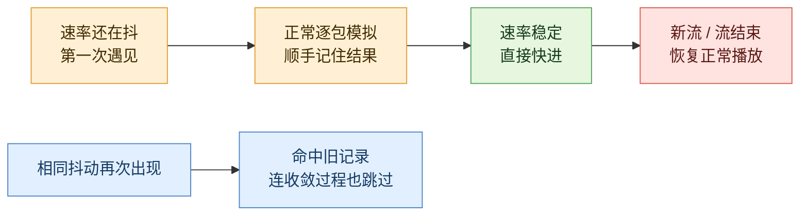
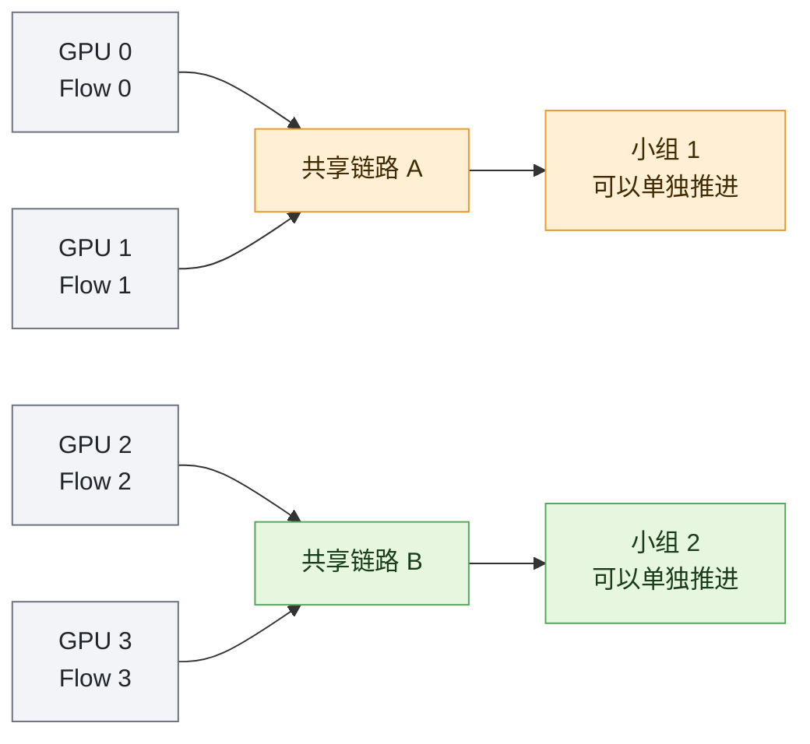
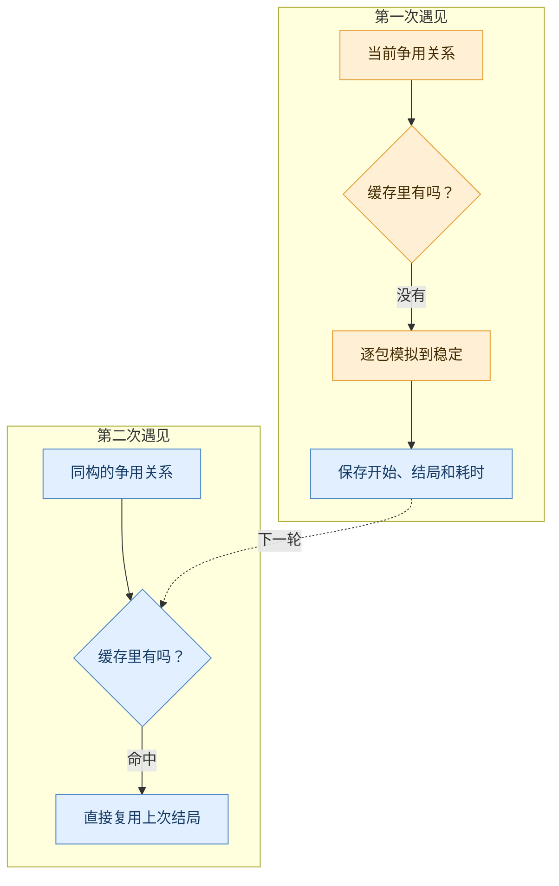
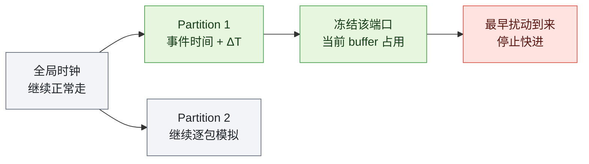
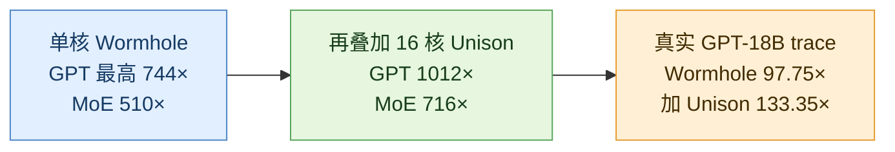

你想测试一个 1024-GPU 训练集群的新拥塞控制算法。真机太贵，于是把通信过程交给 ns-3；结果模型只训练一轮，仿真器却可能要跑上几周。

慢的不是“训练”，而是仿真器太认真：一个包什么时候发、在哪排队、何时收到 ACK、拥塞窗口怎样变化，它都要逐件处理。Wormhole 的想法是：**保留包级仿真，但认出那些以前演过、或者已经不再变化的片段，直接剪掉。**

读完这篇，你应该能用自己的话回答三个问题：Wormhole 剪掉了什么、为什么它敢剪，以及论文里的 1000× 到底是什么口径。

## 30 秒版：它其实只做了两件事

先把一条流的发送速率想成视频时间线。

_自绘图 1：黄色是尚未稳定的过程，绿色是可以快进的稳定区间，蓝色是缓存复用，红色是必须停下来的扰动。_

论文给这两件事起了正式名字：

- 以前算过的不稳定过程，使用 **memoization（记忆化）**复用；
- 拥塞控制收敛后的稳定过程，使用 **fast-forwarding（快进）**跳过。

到这里先只记住一句：**Wormhole 不是让每个包算得更快，而是让绝大多数包事件不必再次执行。**

## 为什么不直接换一个更粗的模拟器？

如果只关心“一条流平均能分到多少带宽”，flow-level 模拟器确实快得多。但新拥塞控制算法最容易出问题的，往往正是平均值下面的细节：队列突然堆积、ECN 标记、丢包、RTT 抖动，以及发送端收到反馈后怎样调速。

把它类比成高速公路：flow-level 模拟只告诉你“这条路平均每分钟过 100 辆车”；packet-level 模拟则会看到每辆车在哪个收费口排队、哪一秒开始堵。Wormhole 不想拆掉摄像头，它只是给录像加上“识别重复片段”和“稳定路段倍速播放”。

这个类比也有边界：网络里还有 ACK、共享缓存、ECN、PFC 等精确机制，不能真拿公路模型做数值计算。它只帮助我们理解为什么“保留细节”和“少执行事件”可以同时成立。

## 训练流量里，真的有那么多片段可以剪吗？

大模型训练会一轮轮重复相同的 collective。相同 GPU、相同并行策略和相同路径，会让“哪些流在抢同一段链路”反复出现；长达 GB 级别的 data-parallel 流一旦调稳，后面又有很长一段时间几乎没有新剧情。

看下面这张论文原图时，不必盯每根柱子，只看两个数字：真实 GPT-18B trace 里，65,870 次争用只对应 1,488 种不同模式；稳定状态占了 98.82% 的时间。

_论文 Figure 3：左图统计重复 contention pattern，右图统计 steady-state 占比。它证明这些 workload 里冗余很多，但还不能证明任意多租户网络也一样。来源：Long et al., NSDI '26。_

合成 workload 中，dense GPT 的稳态占比超过 99%，MoE 大约 97.5%。MoE 更低也符合直觉：expert parallel 的 all-to-all 更动态，流之间的关系没有 dense training 那么整齐。

## 用四张 GPU，把整个过程走一遍

先不看论文里的大拓扑。假设只有四张 GPU，正在发送四条 flow：GPU 0 和 GPU 1 会抢链路 A；GPU 2 和 GPU 3 会抢链路 B。A、B 彼此不共享链路。

_自绘图 2：只要两条流抢过同一条链路，它们就放进同一个小组。两个小组没有共享链路，可以各走各的时间线。_

现在让仿真跑两轮 collective：

1. 第一轮，小组 1 的流刚启动，速率还在变化。Wormhole 没见过这种争用，只能老实逐包模拟，并把“开始时长什么样、最后怎样稳定”存下来；
2. 速率稳定后，只要没有新流、旧流完成或重路由，Wormhole 按平均速率把这段时间直接推过去；
3. 第二轮，完全相同的争用再次出现。Wormhole 找到第一轮的记录，连前面的调速过程也复用；
4. 某条新流进入，小组关系改变，快进立即停止并重新分组。

读完这个例子，整篇论文已经完成了七成。后面的 partition、FCG、steady-state detection，只是在回答：**怎样让这四步既快，又不把模拟结果弄错。**

## Wormhole 怎么知道哪些流可以分开处理？

刚才的“小组”就是论文里的 **network partition**。规则不是“在同一台交换机上”，而是“是否共享同一条 link / port”。共享链路的 flow 会互相影响，必须放在一起；没有共享链路的 partition 才能分别快进。

实现时，Wormhole 画一张 flow–link 二部图：flow 经过某条 link 就连边，再用 DFS 找连通分量。新流到来时只合并它碰到的 partition；流结束时也只检查原来的 partition 是否需要拆开，不必重算全网。

_论文 Figure 4：左侧是正式版 partition，右侧是下一节要用的 FCG。原图比玩具例子完整，但读法相同：橙色和绿色代表两个可分别推进的流集合。来源：Long et al., NSDI '26。_

需要警惕的是，不共享链路不等于物理世界里完全无关。不同端口仍可能共享交换机 buffer、PFC headroom 或内部调度。论文后面专门补了一个“冻结缓存占用”的机制，但这仍是一条需要验证的近似边界。

**所以 partition 省掉了什么？** 它避免“一条新流让整个网络都不能快进”，把影响限制在真正共享链路的小范围里。

## Wormhole 怎么认出“这段拥堵以前见过”？

只比较 flow 数量肯定不够。四条流可以互不相干，也可以全部挤在一条链路上。Wormhole 真正比较的是“谁和谁抢路”。

它把每个 partition 压成一张 Flow Conflict Graph，简称 **FCG**：

- 点是一条 flow，点上的数字是当前发送速率；
- 两条 flow 共享过链路，就连一条边；
- 边上的数字是二者重叠的链路数量。

_自绘图 3：第一次 cache miss 仍然要逐包模拟；第二次匹配到同构 FCG，才有资格复用。_

数据库不用保存每一个瞬间，只保存开始时的 FCG，以及结束时的 FCG、每条流在这段时间发了多少数据、花了多久收敛。查找时先按点数和边数过滤，再做 weighted graph isomorphism。

这里最脆弱的假设也出现了：FCG 忽略绝对路径长度和拓扑位置。两个图看起来同构，但若 RTT、链路容量、队列状态、ECN/PFC 配置不同，调速过程未必相同。一个稳妥实现还应把完整网络配置放进 cache namespace；论文没有把这个 key 列清楚。

**所以 FCG 省掉了什么？** 它省掉重复执行的 CCA 收敛过程，但只有 cache hit 时才省得到。

## 只看发送速率，怎样判断“真的稳定了”？

先不用公式。假设最近几次采样得到 `98、100、102 Gbps`，平均是 `100`，最高和最低只差 `4`，相对波动就是 `4%`。如果容许阈值是 `5%`，这条 flow 可以被判为稳定。

论文把这个判断写成：

$$
\Delta R_l(t)=
\frac{\max R(t_k)-\min R(t_k)}
{\frac{1}{l}\sum_{k=1}^{l}R(t_k)}<\theta
$$

$l$ 是连续观察多少次，$\theta$ 是允许抖动多大。论文实验默认 $l=2000$、$\theta=5\%$。阈值越大，越容易提前宣布稳定，通常会更快，也更容易引入误差；窗口越长，判断越保守，进入快进也越晚。

论文进一步证明：在 CCA 已经收敛的前提下，发送速率稳定时，拥塞窗口、RTT、队列长度和 in-flight bytes 也会保持在小范围内。但请注意这个前提：有限窗口只能观察“最近看起来稳定”，它不能彻底排除更晚才出现的长周期变化。

想看严谨版本：论文究竟保证了多少误差？

论文给出的 rate estimation 相对误差上界为：

$$
\left|\frac{\hat R-R}{R}\right|<\frac{\theta}{1-\theta}
$$

steady duration 的相对误差上界为：

$$
\left|\frac{\hat T-T}{T}\right|<\theta
$$

代入 $\theta=5\%$，两个上界分别约为 5.26% 和 5%。所以论文实验里的“平均 FCT 误差小于 1%”不是这两个定理直接保证出来的 worst case，而是特定 workload 上的观测结果。相关证明位于论文明确标记为“未同行评审 supporting material”的附录。

**所以稳态识别省掉了什么？** 它省掉的是收敛以后那段又长、又几乎没有新信息的逐包事件。

## 快进时间，为什么不会把别的流弄乱？

“把时钟往前拨”是危险的。小组 1 可能已经稳定，小组 2 还在激烈变化；如果直接修改 global clock，两个小组的因果顺序会被打乱。

_自绘图 4：不动全局时钟，只偏移当前 partition 的事件；同时保留它对共享缓存的占用，遇到扰动立即停。_

Wormhole 的处理分三步：

1. 不改 global clock，只把当前 partition 的事件 timestamp 整体加上 $\Delta T$；
2. 暂停对应端口的 packet processing，冻结已有 buffer occupancy，避免其他端口凭空多出缓存；
3. 把新流进入、旧流完成、重路由当成“闹钟”。最早的闹钟决定能跳多远。

如果某个实时事件事先不知道，论文还提出 skip-back：事件虽然已被推到未来，但只要全局时钟还没走到那里、那些事件尚未执行，就可以把 partition 拉回更早的时间点。

_论文 Figure 7：正式实现需要同时处理 packet pausing、partition timestamp offset 和实时事件回退；这张图证明“快进”并不是简单修改一行时钟。来源：Long et al., NSDI '26。_

**所以这组实现省掉了什么？** 它没有再省更多事件，而是让前面的“剪片段”不至于破坏其他 partition 看得见的状态。

## 论文里的 1000×，主要是谁贡献的？

先猜一下：是 16 个 CPU 核并行带来的，还是少执行事件带来的？答案主要是后者。

论文的 breakdown 显示，只做 steady-state skipping，GPT workload 已经超过 130×，MoE 超过 50×；在此基础上，memoization 再提供 1.93×–8.43×。两者合计跳过 GPT 超过 99.5%、MoE 超过 99.2% 的事件。

_论文 Figure 9：左边先看 steady-state skipping 的虚线，再看完整 Wormhole 的实线；右边显示超过 99% 的事件被跳过。它说明主要收益来自“少算”，但不代表所有流量都能保持这个跳过率。来源：Long et al., NSDI '26。_

完整数字要分三种口径看：

_自绘图 5：千倍峰值来自理想化 workload 加多核并行；真实 trace 仍接近百倍，但不是千倍。_

需要警惕一处明显的数字矛盾：论文同时写“GPT-13B 从 9 小时降到 5 分钟”并称“超过 1000×”。但 $9\text{ hours}/5\text{ minutes}=108\times$；若真是 1012×，9 小时应该降到约 32 秒。Figure 8 的曲线确实接近千倍，所以绝对时间或文字至少有一处写错了。

## “误差不到 1%”应该怎样理解？

先把两个经常被混在一起的结果拆开：

| 场景 | 指标 | Wormhole 结果 |
| --- | --- | --- |
| SimAI 生成的理想 workload | 平均 per-flow FCT 相对误差 | `<1%` |
| 真实 256-GPU GPT-18B trace | 端到端训练时间误差 | `3.02%` |

合成实验里，flow-level simulator 的平均 FCT 误差大约 20%，Wormhole 低于 1%。这说明在论文测试的网络规模和三种 CCA 上，剪事件没有明显破坏 FCT；但指标是平均值，不是 p99、最大误差或逐包轨迹的 worst-case guarantee。

真实 trace 更值得看：Wormhole 是 97.75×，Wormhole+Unison 是 133.35×；端到端误差 3.02%，和 ASTRA-sim+ns-3 的 3.01% 几乎相同。

_论文 Figure 14：左边是实际加速，右边是端到端训练时间误差。它支持“真实 trace 仍有约百倍收益”，但论文只有一个真实训练场景。来源：Long et al., NSDI '26。_

论文还测了每个场景**第一条 flow**的 packet RTT，NRMSE 低于 0.005。这是有价值的 packet-level fidelity 证据，但范围比“所有 flow、所有 packet、所有 loss/queue tail”窄，不能外推成所有微观指标都完全保真。

## 什么样的场景最适合 Wormhole？

它最喜欢这样的 workload：并行策略固定、collective 周期重复、data-parallel elephant flow 很长、路径稳定、扰动能够提前知道。做同一训练系统的大量 design-space sweep 时，这些条件尤其常见。

它不太喜欢：短流很多、租户随机加入、频繁 reroute、链路故障密集、负载均衡持续改变路径。论文说最坏情况下会退化回 ns-3 baseline，但没有画出一个强随机、多租户 workload 的完整退化曲线。

我的理解是：Wormhole 保住的是“足够重建 FCT 和末态的包级基座”，不是把被跳过区间里的每个 microburst、ECN 序列、PFC pause 和瞬时队列波形继续保留下来。若研究目标正是这些瞬态细节，就不应该跳过它们。

## 代码真的开源了吗？

截至 2026-08-14，USENIX 和 arXiv 页面都没有给出最终 Wormhole 的正式 GitHub 仓库。不过，作者上传的 arXiv LaTeX 源码里有一个被注释掉的 [anonymous.4open.science artifact](https://anonymous.4open.science/api/repo/Wormhole/zip)。我下载并检查了它。

这个快照更像 2025 年初的早期 steady-state-skipping prototype，而不是最终论文的完整实现：

| 能看到 | 没看到或没有启用 |
| --- | --- |
| QP 发送速率采样与稳态判定 | FCG、图同构查询和 memoization database |
| 估计下一个 flow arrival / completion | 活跃的动态 port-level partition；相关代码主要被注释 |
| 扣减剩余字节并偏移 simulator event | 每个 partition 独立 timestamp offset |
| 基于 Alibaba HPCC ns-3 的修改，GPL v2 | packet pausing、完整 skip-back、Unison 并发数据库 |

快照里还硬编码了 $l=1000,\theta=3\%$，与论文默认的 $l=2000,\theta=5\%$ 不同；README 主要仍是上游 HPCC 文档，构建依赖老旧的 gcc-5 / Python 2，也没有足以复现 headline 结果的测试和日志。

所以最准确的说法是：**公开快照能证明作者做过“稳态检测 + 事件快进”的早期主干，但不能独立复现最终论文的 744× / 1012×。**

## 这篇论文最强、也最脆弱的地方是什么？

我认为它最强的三点是：

1. 找对了瓶颈：不是继续堆 CPU，而是直接消除重复事件；
2. 三个抽象能互相接上：partition 管依赖，FCG 管重复，rate window 管稳定；
3. 真实 trace 虽然从千倍降到百倍，仍然有明显工程价值。

最脆弱的三点是：

1. FCG 同构是否足够代表相同 transient，依赖配置域和网络状态；
2. 高收益依赖训练流量的强重复、长稳态，随机 workload 证据不足；
3. 最终实现没有正式公开，论文数字无法由现有 artifact 闭环复现。

另外还有两处值得记录的论文笔误：Figure 12 和判定式显示 $l$ 增大会降低 speedup、$\theta$ 增大会提高 speedup，正文却把方向写反；Appendix H 文字说 1024 GPU 的数据库 `<100 KB`，同页 Figure 15b 则大约是 370–510 KB。后一个数字仍然不到 0.6 MB，不影响“可内存驻留”的结论，但不能照抄 `<100 KB`。

## 论文信息放在最后，也来得及

| 项目 | 内容 |
| --- | --- |
| 论文 | *Supercharging Packet-level Network Simulation of Large Model Training via Memoization and Fast-Forwarding* |
| 作者 | Fei Long, Kaihui Gao, Li Chen, Dan Li, Yiwei Zhang, Fei Gui, Yitao Xing, Wenjia Wei, Bingyang Liu |
| 发表 | 23rd USENIX NSDI, 2026, pp. 1131–1151 |
| 正式页面 | [USENIX presentation page](https://www.usenix.org/conference/nsdi26/presentation/long) |
| 正式论文 | [USENIX PDF](https://www.usenix.org/system/files/nsdi26-long.pdf) · [arXiv](https://arxiv.org/abs/2602.10615) |
| 可访问代码 | [匿名预发布 artifact](https://anonymous.4open.science/api/repo/Wormhole/zip)，不是最终完整实现 |

## 最后三句话

Wormhole 没有把包级仿真换成粗糙模型，而是学会判断哪些包事件不必重放。最大的收益来自快进长稳态，memoization 是第二层放大，多核并行再叠在上面。这个想法很漂亮、真实 trace 也有约百倍收益，但公开代码离最终论文仍有明显距离。

---

论文图表来自 Long et al., *Supercharging Packet-level Network Simulation of Large Model Training via Memoization and Fast-Forwarding*，[arXiv:2602.10615v1](https://arxiv.org/abs/2602.10615)。

原图按 [CC BY 4.0](https://creativecommons.org/licenses/by/4.0/) 使用；为网页排版做了裁切与组合，数据未修改。

自绘图由 burger / Parallel Bites 根据论文机制重新绘制，不代表论文原图。最后核验日期：2026-08-14。
