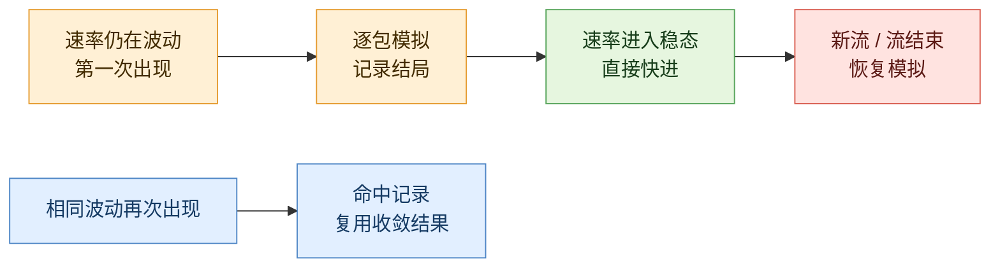
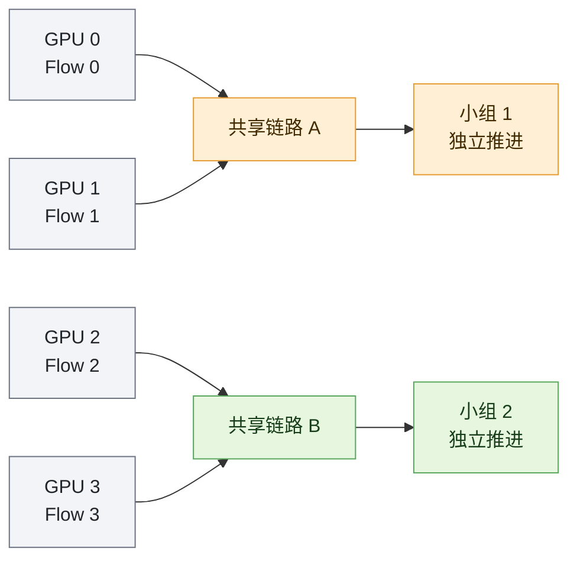
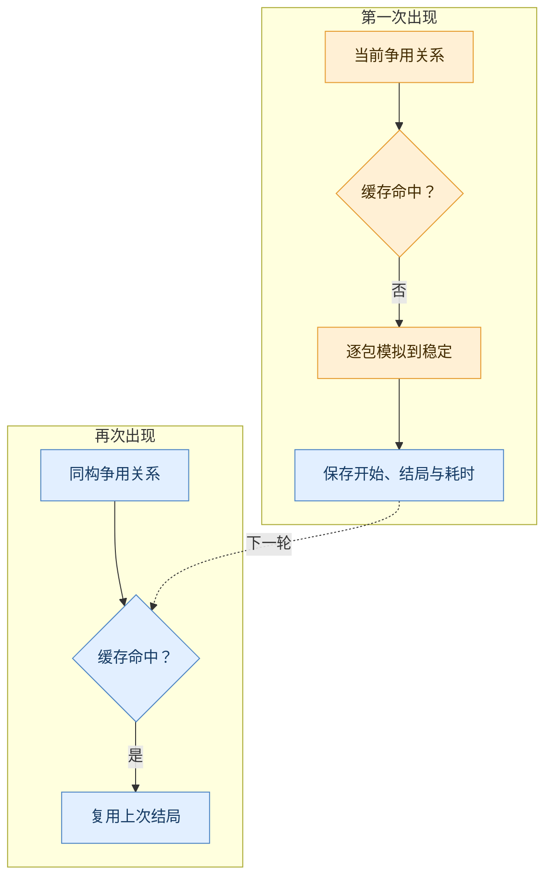
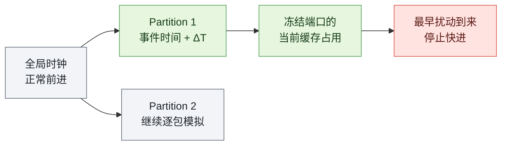
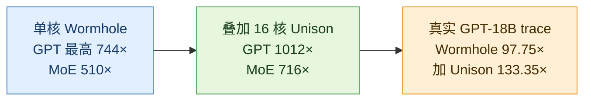

在大模型训练系统里，被模拟的训练可能只前进一个 iteration，墙上的时间却已经过去几周。规模到了上千张加速卡，ns-3 需要处理的离散事件可以冲向万亿级：发包、排队、离队、确认报文、拥塞反馈、窗口更新，一个都不能乱序。

这听起来像一个单纯的性能问题，真正棘手的地方却在于：**包级仿真最昂贵的部分，恰好也是它最有价值的部分。** 队列怎样长起来、拥塞控制怎样收敛、丢包发生在哪一刻，都是粗粒度模型最容易丢掉的东西。

NSDI '26 论文 Wormhole 没有换掉 ns-3，也没有试图让每个包算得更快。它的核心判断是：大模型训练流量里有大量已经演过的争用，以及长时间没有新剧情的稳态。仿真器只需运行到足以认出当前动力学，之后便可以复用结局，或者直接快进。

## 包级仿真的悖论

只计算一条流平均能分到多少带宽，flow-level 模拟器当然快得多。但平均值下面藏着网络系统最关心的细节：队列突增、拥塞标记、往返延迟抖动、丢包，以及发送端收到反馈之后怎样调速。

这像两种观察高速公路的方式。粗粒度模型记录“每分钟通过 100 辆车”，包级模型则保留每辆车经过收费口的时刻和排队顺序。Wormhole 没有拆掉摄像头，而是给录像加上两种剪辑能力：见过的片段直接复用，画面稳定后倍速播放。

类比到这里就应该停止。真实网络还有 ACK、共享缓存、ECN、PFC 和协议内部状态，不能用公路模型做数值推导。它只揭示了 Wormhole 的出发点：**保留观察精度，不等于必须重放每个事件。**

## 训练流量里的两段“废片”

第一段废片出现在拥塞控制尚未收敛的时候。发送速率还在波动，但固定的并行策略会反复制造相同的 collective、相同的路径和相同的争用关系。同一出戏第二次上演，未必还要从头计算。

第二段更长。拥塞控制一旦收敛，GB 级 data-parallel 流会以近似稳定的速率持续很久。只要中间没有新流、流完成或重路由，逐包执行只是在重复确认“系统依然稳定”。

_自绘图 1：黄色是不稳定过程，绿色是可快进的稳态，蓝色是缓存复用，红色是必须停下的扰动。_

论文把前一种能力称为 **memoization（记忆化）**，后一种称为 **fast-forwarding（快进）**。前者剪掉重复的收敛过程，后者剪掉收敛之后的漫长等待。

这套设计成立的前提，是训练流量确实足够重复。论文在一份真实 GPT-18B trace 中发现，65,870 次争用只对应 1,488 种不同模式，稳态又占据 98.82% 的时间。合成 workload 里，dense GPT 的稳态比例超过 99%，更动态的 MoE 也在 97.5% 左右。

_论文 Figure 3：左图统计重复 contention pattern，右图统计 steady-state 占比。它证明测试 workload 中存在大量冗余，但不能证明任意多租户网络也有相同结构。来源：Long et al., NSDI '26。_

这组数字不是加速结果，却比加速结果更重要。它说明 Wormhole 不是凭空发明近似，而是先在工作负载里找到了可以被压缩的结构。

## 从四张 GPU 开始

把网络缩小到四张 GPU。GPU 0 和 GPU 1 的流会争抢链路 A，GPU 2 和 GPU 3 的流会争抢链路 B；A 与 B 之间没有共享链路。

_自绘图 2：共享链路的流被放进同一组；两个没有共享链路的小组可以沿各自的时间线推进。_

第一轮 collective 到来时，小组 1 的发送速率仍在变化。Wormhole 没有历史记录，只能老实地逐包模拟，并保存这段争用从什么状态开始、最终怎样稳定。

速率稳定后，中间的包事件被直接跨过。第二轮 collective 再次产生相同的争用，数据库命中第一次留下的记录，连收敛过程也不必重放。直到新流加入、旧流结束或路径改变，快进才被打断，小组关系也随之重算。

这个四节点故事已经包含整篇论文的主干。剩下的设计都在给“可以跳过”补充严格条件：哪些流互相独立，怎样判断两段争用相同，什么时候算稳定，以及如何快进而不破坏因果关系。

## 第一刀：把互不相干的流拆开

如果只在全网范围判断稳态，一条角落里的新流就足以让所有流停止快进。Wormhole 因此把共享同一条 link / port 的流划进同一个 **network partition**，没有共享链路的 partition 则分别推进。

实现上，它构造一张 flow–link 二部图：一条流经过某条链路，两者便连一条边；图中的连通分量就是 partition。新流到来时只合并它触及的分区，流结束时也只检查原分区是否需要拆开，而不是重算整个网络。

_论文 Figure 4：左侧是端口级 partition，右侧是下一节使用的 FCG。橙色与绿色代表两个可以分别推进的流集合。来源：Long et al., NSDI '26。_

端口级分区把局部扰动留在局部，也让快进和多核调度获得更细的粒度。但“不共享链路”不等于物理世界里完全无关：不同端口仍可能共享交换机缓存、PFC headroom 或内部调度。论文用冻结缓存占用来保留其中一部分耦合，这依然是一条近似边界。

## 第二刀：给拥堵模式拍一张关系快照

流的数量相同，不代表网络状态相同。四条流可能互不相干，也可能全部挤在一条链路上。真正决定拥塞演化的，是“谁在和谁抢路”。

Wormhole 把这种关系压缩成 **Flow Conflict Graph（FCG）**：图上的点代表流，点权是当前发送速率；两条流共享链路便连边，边权记录重叠链路的数量。

_自绘图 3：第一次 cache miss 仍需逐包模拟；同构 FCG 再次出现时，才会复用上次的收敛结果。_

数据库不保存完整时间序列，只保存开始与结束时的 FCG、每条流在不稳态期间发送的数据量，以及收敛耗时。查询先按点数和边数过滤，再做加权图同构匹配。

整个 memoization 最脆弱的假设，也藏在这张快照里。FCG 忽略了绝对路径长度和拓扑位置；若 RTT、链路容量、队列状态、ECN/PFC 配置或拥塞控制内部状态不同，两张同构的图未必会走向同一个结局。实际数据库理应按完整配置隔离，论文却没有把 cache namespace 的边界交代清楚。

## 第三刀：稳定不等于静止

网络进入稳态，并不意味着发送速率成为一条完全水平的直线。拥塞控制本来就会轻微振荡，Wormhole 判断的是这段振荡是否已经足够小。

例如，连续采样得到 `98、100、102 Gbps`，平均值为 `100`，最大值与最小值相差 `4`，相对波动就是 `4%`。若阈值设为 `5%`，这条流会被判为稳定。论文写成公式就是：

$$
\Delta R_l(t)=
\frac{\max R(t_k)-\min R(t_k)}
{\frac{1}{l}\sum_{k=1}^{l}R(t_k)}<\theta
$$

$l$ 是连续观察的采样数，$\theta$ 是允许的波动幅度。论文默认 $l=2000$、$\theta=5\%$。阈值越大，越容易提前宣布稳定，速度可能更高，误判风险也更大；窗口越长，判断越保守，快进开始得越晚。

论文进一步论证：在拥塞控制已经收敛的前提下，发送速率稳定时，拥塞窗口、RTT、队列长度和 in-flight bytes 也会维持在有限范围内。这里的前提不容忽略。一个有限窗口只能证明“最近看起来稳定”，无法彻底排除延迟反馈或更长周期的变化。

理论上界与实验误差不是同一个数字

论文给出的速率估计相对误差上界为：

$$
\left|\frac{\hat R-R}{R}\right|<\frac{\theta}{1-\theta}
$$

稳态持续时间的相对误差上界为：

$$
\left|\frac{\hat T-T}{T}\right|<\theta
$$

代入 $\theta=5\%$，两个上界分别约为 5.26% 和 5%。实验里的“平均 FCT 误差小于 1%”并不是两个定理直接保证的 worst case，而是特定 workload 上的观测。相关证明位于论文明确标注为“未同行评审 supporting material”的附录。

## 快进的前提，是不碰全局时钟

真正危险的不是识别稳态，而是推进时间。一个 partition 可能已经稳定，另一个仍在剧烈变化；若直接拨动全局时钟，两者之间的因果顺序便会被打乱。

_自绘图 4：全局时钟照常运行，只偏移当前 partition 的事件；缓存占用被冻结，扰动到来时立即停止。_

Wormhole 不修改 global clock，而是把当前 partition 的事件 timestamp 整体增加 $\Delta T$。对应端口的包处理被暂停，已有 buffer occupancy 则被冻结，避免其他端口凭空获得更多共享缓存。

新流进入、旧流完成和重路由成为三类“闹钟”，最早到来的一个决定能跳多远。对于事先未知的实时事件，论文还设计了 skip-back：只要被推迟的事件尚未执行，partition 就能被拉回更早的时间点。

_论文 Figure 7：正式设计同时处理 packet pausing、partition timestamp offset 和实时事件回退。“快进”远不只是改动一行时钟。来源：Long et al., NSDI '26。_

前面的三刀负责减少事件，这组运行时机制负责守住因果关系。它本身没有制造加速，却决定了那份加速能否被相信。

## 千倍加速，主要不是多核带来的

Wormhole 最醒目的数字是 1012×，但这个数字把两种加速叠在了一起。论文的 breakdown 表明，只做 steady-state skipping，GPT workload 已经超过 130×，MoE 超过 50×；memoization 在此基础上再提供 1.93×–8.43×。

_论文 Figure 9：左图中虚线代表只跳过稳态，实线代表完整 Wormhole；右图显示超过 99% 的事件被跳过。主要收益来自“少算”，但这不意味着任意流量都有相同跳过率。来源：Long et al., NSDI '26。_

两种机制合计跳过了 GPT 超过 99.5%、MoE 超过 99.2% 的事件。千倍加速首先来自事件消失，然后才是多个 CPU 核把剩余工作并行执行。

_自绘图 5：千倍峰值来自理想化 workload 与多核并行的叠加；真实 trace 仍接近百倍，但没有达到千倍。_

论文在绝对时间上留下一处无法同时成立的表述：一处写 GPT-13B 从 9 小时降到 5 分钟，另一处称加速超过 1000×。前者换算只有 108×；若真达到 1012×，9 小时应缩短到约 32 秒。Figure 8 的曲线确实接近千倍，因此绝对时间或文字至少有一处错误。

## 速度之外，误差账必须拆开

“误差不到 1%”只属于合成实验中的平均 per-flow FCT。到了真实 GPT-18B trace，论文报告的是另一项指标：端到端训练时间误差 3.02%。两个数字不能合并成一句笼统的“误差小于 1%”。

| 场景 | 指标 | Wormhole 结果 |
| --- | --- | --- |
| SimAI 生成的理想 workload | 平均 per-flow FCT 相对误差 | `<1%` |
| 真实 256-GPU GPT-18B trace | 端到端训练时间误差 | `3.02%` |

合成实验中，flow-level simulator 的平均 FCT 误差约为 20%，Wormhole 低于 1%。真实 trace 上，Wormhole 加速 97.75×，叠加 Unison 后达到 133.35×；3.02% 的端到端误差与 ASTRA-sim+ns-3 的 3.01% 几乎相同。

_论文 Figure 14：左图是实际加速，右图是端到端训练时间误差。它支持“真实 trace 仍有约百倍收益”，但真实训练场景只有一个。来源：Long et al., NSDI '26。_

论文还检查了每个场景第一条 flow 的 packet RTT，NRMSE 低于 0.005。这是有价值的包级保真证据，范围却远小于“所有流、所有包、所有丢包与队列尾部”。Wormhole 近似保存的是 FCT 和末态，不是被跳过区间里的完整微观轨迹。

## 它擅长的是结构化训练，不是所有网络

固定的并行策略、周期重复的 collective、长 data-parallel elephant flow、稳定路径和可预测扰动，共同构成了 Wormhole 的甜蜜点。对同一训练系统进行大批量 design-space sweep，这些条件相当常见。

短流密集、租户随机加入、频繁重路由、链路故障或负载均衡持续改路的网络，则会让模式复用和稳态快进同时缩水。论文声称最坏情况会退化回 ns-3 baseline，却没有展示一个强随机、多租户 workload 的完整退化曲线。

更根本的边界在研究目标本身。若问题关注 microburst、ECN 标记序列、PFC pause、重传细节或瞬时队列波形，被跳过的事件恰恰就是答案。此时，保持包级模拟器作为基座并不等于仍然保留了所有包级 observable。

## 论文之外：公开代码还停在早期原型

截至 2026-08-14，USENIX 与 arXiv 页面都没有给出最终 Wormhole 的正式 GitHub 仓库。不过，作者上传的 arXiv LaTeX 源码中留下了一个被注释掉的 [anonymous.4open.science artifact](https://anonymous.4open.science/api/repo/Wormhole/zip)。

对这份快照的检查显示，它更接近 2025 年初的 steady-state-skipping prototype，而不是论文描述的完整系统。

| 能看到 | 没看到或没有启用 |
| --- | --- |
| QP 发送速率采样与稳态判定 | FCG、图同构查询和 memoization database |
| 估计下一个 flow arrival / completion | 活跃的动态 port-level partition；相关代码主要被注释 |
| 扣减剩余字节并偏移 simulator event | 每个 partition 独立 timestamp offset |
| 基于 Alibaba HPCC ns-3 的修改，GPL v2 | packet pausing、完整 skip-back、Unison 并发数据库 |

快照还硬编码了 $l=1000,\theta=3\%$，与论文默认的 $l=2000,\theta=5\%$ 不同。README 主要沿用上游 HPCC 文档，构建依赖老旧的 gcc-5 / Python 2，也没有足以复现 headline 结果的测试或日志。

这份 artifact 能证明作者实现过“稳态检测 + 事件快进”的早期主干，却无法独立闭环论文最终的 744× 与 1012×。把它称为 Wormhole 已完整开源，会高估当前的可复现状态。

## 一项漂亮、但带条件的优化

Wormhole 最漂亮的地方，不是某个图算法或阈值，而是对瓶颈的重新定义。传统优化试图更快地执行离散事件；它先问这些事件是否还有执行的必要。partition 管住影响范围，FCG 识别重复关系，rate window 找到可以快进的稳定区间，三层抽象最终落在同一条因果链上。

它最脆弱的地方也由此而来。FCG 同构是否真的代表相同 transient，依赖论文没有完整写入 key 的配置状态；高收益依赖训练流量的强重复与长稳态；现有公开 artifact 又不足以复现最终实现。

论文自身还有几处值得记录的文字问题：Figure 12 与判定式显示 $l$ 增大会降低 speedup、$\theta$ 增大会提高 speedup，正文却把方向写反；Appendix H 写 1024 GPU 的数据库 `<100 KB`，同页 Figure 15b 则约为 370–510 KB。后者仍不到 0.6 MB，不影响“可以常驻内存”的判断，却不能照抄为 `<100 KB`。

Wormhole 因而不是“包级仿真已经可以免费获得”的证明。它展示的是另一件更有启发性的事：**对于高度结构化的大模型通信，逐包模型只需运行到足以认出当前动力学；其余时间，可以被有条件地折叠。** 真实 trace 上接近百倍的收益已经足够重要，而那些条件，恰好决定了它应当被用在哪里。

## 论文与核验资料

| 项目 | 内容 |
| --- | --- |
| 论文 | *Supercharging Packet-level Network Simulation of Large Model Training via Memoization and Fast-Forwarding* |
| 作者 | Fei Long, Kaihui Gao, Li Chen, Dan Li, Yiwei Zhang, Fei Gui, Yitao Xing, Wenjia Wei, Bingyang Liu |
| 发表 | 23rd USENIX NSDI, 2026, pp. 1131–1151 |
| 正式页面 | [USENIX presentation page](https://www.usenix.org/conference/nsdi26/presentation/long) |
| 正式论文 | [USENIX PDF](https://www.usenix.org/system/files/nsdi26-long.pdf) · [arXiv](https://arxiv.org/abs/2602.10615) |
| 可访问代码 | [匿名预发布 artifact](https://anonymous.4open.science/api/repo/Wormhole/zip)，不是最终完整实现 |

---

论文图表来自 Long et al., *Supercharging Packet-level Network Simulation of Large Model Training via Memoization and Fast-Forwarding*，[arXiv:2602.10615v1](https://arxiv.org/abs/2602.10615)。

原图按 [CC BY 4.0](https://creativecommons.org/licenses/by/4.0/) 使用；为网页排版做了裁切与组合，数据未修改。

自绘图由 burger / Parallel Bites 根据论文机制重新绘制，不代表论文原图。最后核验日期：2026-08-14。
